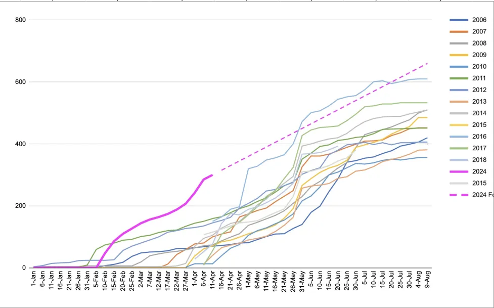

# Registration hits 300!

Our intrepid alliance of AGA old-timers and Portland Go Club up-and-comers has been toiling dilligently forward on preparations for the 40th Annual US Go Congress.  We are excited to have hit 300 registrants as of April 8, which puts us about two weeks earlier for hitting this mark than any other year for which there is data, and over a month ahead of the average for the last 20 years.  We are using this mark as a chance to celebrate the hard work and countless volunteer hours put into this year already, and to keep ourselves excited for all the work left to come.

For those who don't know, I'm Stew, a Portland Go Player and Co-Director of this year's Congress. I want to take this chance to remind everyone that we are working to make Congress more affordable and registering before April 15 will get you in for $100 cheaper than the standard rate last year, and save you $50 off the regular price for this year. I also want to take this opportunity to talk about some of the excitement happening in the planning process, and give a rundown of some hot tips for navigating Registration this year.

Lets start with the business side - <a href="https://gocongress.org/registration/">How to register</a>.  The important thing to remember, once you click the big yellow 'Register' button is that for most people this is a 3-STEP PROCESS.  Make sure to look at all the links on the registration page so you don't miss a piece.  And, for those who want to eat in the dining hall but aren't staying in the dorms, note that there is a portal for pre-purchasing meals that you find by first going to the PSU housing link. The 3-Steps to Register are:
1. Register as an AGA member (you must have an active membership with the AGA to Register.  If this is an issue for you you can reach out to registrar@gocongress.org to talk options)
2. Register for the Congress itself.  This you will do by clicking the link from the gocongress.org/registration portal, which will take you to the Club Express interface. This step is what will get you your attendee badge, T-shirt, swag bag and access to the tournaments, workshops and events of the 40th Annual Go Congress.  Also this is where you can register to attend the closing banquet.
3. Book yourself somewhere to stay! If you are local to Portland or have friends to crash with in the area, you can skip this.  However, for most attendees this is an important one not to forget.  This year the AGA and local organizers decided to reduce the financial complexities and propensity towards issues that come with having housing directly facilitated within Congress registration.  Instead, we have partnered with some nearby hotels and the PSU dorms to setup blocks of discounted rooms which are all on a first-come first-served basis.  The dorms offer incredible value (if you split a double it comes out to roughly $30 dollars a night per-person) for those on a budget, and our partner University Place Hotel offers a great option for getting an affordable hotel room (with breakfast included) with easy access to the event on foot or even via the Streetcar (which runs every 15 minutes).

Now for the fun stuff.  This year we have already confirmed 18 Professional players (including legends like Kim Jiseok and Youtube sensations like Eunkyo Do).  I'm particularly excited to be welcoming Myungwan Kim to this year's event, a Korean 9p who has visitted the Portland Go Club many times and is a local favorite.  I've also been in talks with Swag providers and am very excited about having many of the usual suspects in your swag bags (yes, you will get a branded Go Congress bag, with T-Shirt and Pin and other goodies), but most of all I am excited about our special "the chairs are hard plastic so we're making 40th Annual Go Congress Seat CUSHIONS!!!" swag this year.  Yep.  It may not sound like much, but all attendees registering for the full event will get a commemorative seat cushion - great for those long tournament days during the event and working in the Garden when you get home.  I'm also very excited to be offering some awesome excursions during the Wednesday "off-day" this year, including tours of the Lan Su Chinese Garden and Portland Japanese Garden.  

I could go on for many more paragraphs about cool stuff in Portland and why the 40th Annual Go Congress is one not-to-be-missed, but I'll limit myself to this one more thing.  In the Self-Guided Excursions department we will have an easy guide available for those who want to take a very Portland tour of the city by doing the "4-T's".  The 4-T's is a really cool circumnavigation of the city that is done entirely on foot or using public transportation.  The T's stand for Train, Trolley, Tram and Trail, and the route goes literally right past where Congress is taking place. You ride the Portland Streetcar (Trolley) through downtown to hop on the Max Train (kinda like Portland's wannabe-subway) which takes you up to the Portland Zoo and Forestry Center.  From there you take a beautiful hike across the ridgeline of Portland's West Hills, overlooking the whole city and Mt. Hood with panaoramic views to arrive at the Oregon Health and Science University.  Then you hop on the Portland Sky-Tram and get a final scenic voyage down from the hills to the South Waterfront area.  From there you can go take a walk along the Wilammette river (if you have more walking in you), pop-in to a coffee-shop or restuarant for a pick-me up, or rush on to complete the cycle by hopping back on the Streetcar to Smith Memorial Student Union and a fine, refreshing self-paired game of Go.

I'll stop there (thanks to any who managed to stick it out to the end of my rambling blog post).  Suffice to say, we are super stoked to be at 300 Registrants already and so excited to invite the entire Go Community to come enjoy the game and the city that we love so dear.

