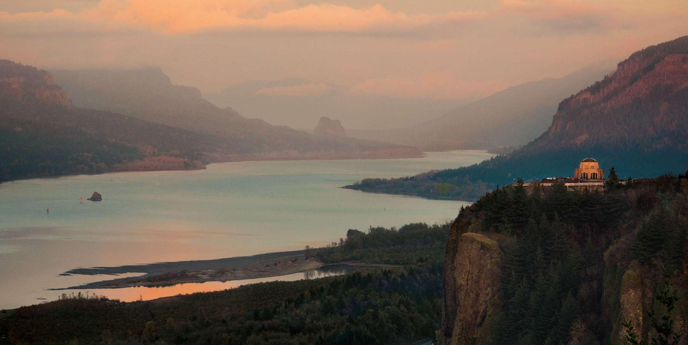
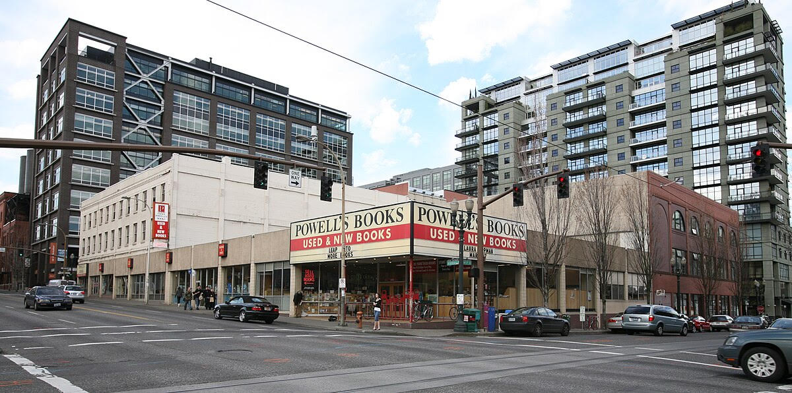
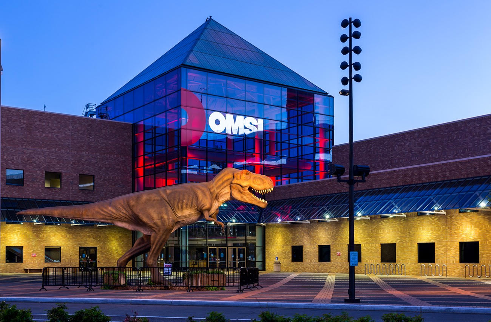
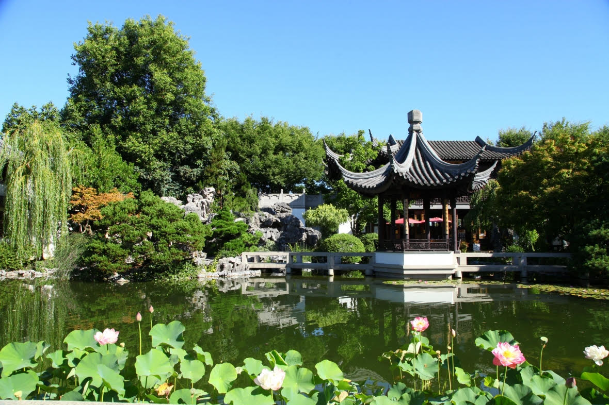
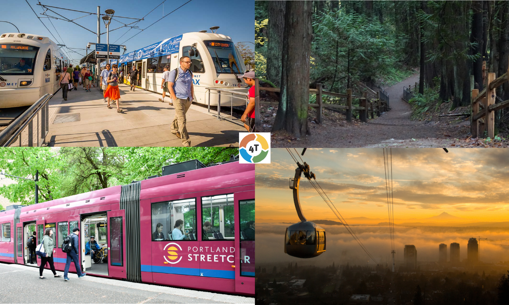
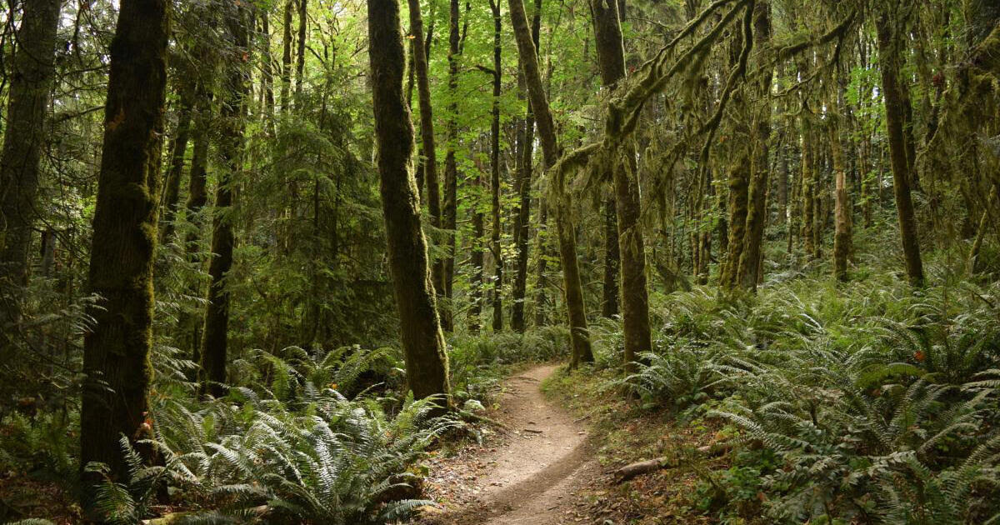
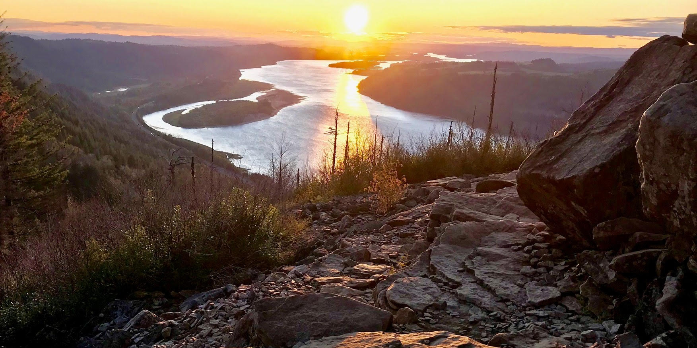
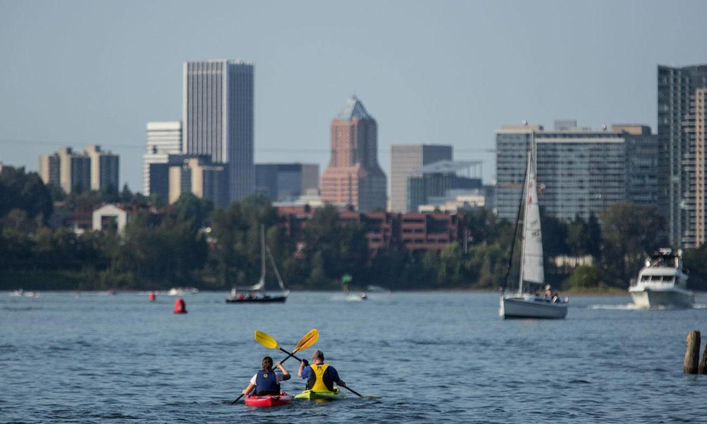

# Wednesday Off-Day Excursions!!!

## Columbia Gorge Excursion
The Go Congress has chartered a bus to make a guided excursion through the scenic Columbia Gorge. This excursion leaves on our off day (Wednesday) and stops for some photography and hike opportunities, followed by a drive along the Columbia river, a stop for lunch in Carson, followed by a visit to the Bonneville Dam and Fish Hatchery. The price is $49 per person. We have a planned lunch stop at the Backwoods Brewing Company in Carson -- please bring money for lunch!

Note: Due to ongoing repairs by the park service from the 2017 Eagle Creek fire, we've been advised that we need to stay flexible about our exact stop since available parks may vary each day. Our first pick is Multnomah Falls, and we are attempting to get the necessary permit to get a tour group in. We may need to substitute an alternative stop, however!

https://www.multnomahfallslodge.com/
https://www.travelportland.com/region/multnomah-falls/
https://www.backwoodsbrewingcompany.com/
https://myodfw.com/bonneville-hatchery-visitors-guide

## Powell's City of Books
Within walking distance and public transit of the Go Congress is one of the most unique and largest used bookstores in the world! Powell's occupies an entire city block, and each of its nine rooms are the size of a large bookstore in their own right. This includes a rare book room, which includes various first-editions and centuries-old books, and is open to the public.

https://www.powells.com/locations/powells-city-of-books

## OMSI
The Oregon Museum of Science and Industry is a spectacular attraction. OMSI has late-night programming for grownups, and hands-on attractions for all ages. This summer, OMSI's programming includes a special exhibit on the Tyrannosaurus Rex, including several genuine skeletons as well as replicas. You can see more about what's on at OMSI: https://omsi.edu/

## The Gardens
Our venue is within easy transportation of two amazing cultural gardens: the Portland Japanese Garden and Lan Su Chinese Gardens. We will provide information during the Congress about how to get to both of these places via public transit. The Portland Go Club is extremely fond of both gardens, and we have had the pleasure of hosting events at each of them, including our annual Oregon State Championship at the Japanese Garden! Words cannot do these places justice, so you can go see pictures and learn more about them here (including hours and admission rates):

https://japanesegarden.org/
https://lansugarden.org/

## The 4-Ts - Circumnavigate Portland!
The 4-T’s is a really cool circumnavigation of the city that is done entirely on foot or using public transportation. The T’s stand for Train, Trolley, Tram and Trail, and the route goes literally right past where Congress is taking place. You ride the Portland Streetcar (Trolley) through downtown to hop on the Max Train (kinda like Portland’s wannabe-subway) which takes you up to the Portland Zoo and Forestry Center. From there you take a beautiful hike across the ridgeline of Portland’s West Hills, overlooking the whole city and Mt. Hood with panaoramic views to arrive at the Oregon Health and Science University. Then you hop on the Portland Sky-Tram and get a final scenic voyage down from the hills to the South Waterfront area. From there you can go take a walk along the Willamette river (if you have more walking in you), pop-in to a coffee-shop or restuarant for a pick-me up, or rush on to complete the cycle by hopping back on the Streetcar to Smith Memorial Student Union and a fine, refreshing self-paired game of Go.

https://www.4t-trail.org/

## Hiking
Our nearby Forest Park is a 5100-acre park just outside Portland and is accessible via public transit. This is part of the 4T's trail and is also home to the Portland Japanese Garden and Portland Zoo, but the park itself is over 8 miles long and features over 80 miles of trail.
https://www.portland.gov/parks/forest-park

For those of you who will have access to a car, there are other great hiking opportunities nearby, including Angel's Rest, which is a moderately-difficult 5-mile hike about 45 minutes from the Go Congress with a 270-degree panoramic view of the Columbia Gorge.
https://www.oregonhikers.org/field_guide/Angels_Rest_Hike

## Kayaking
The gentle current of the Willamette River is very amenable to kayaking, and there are various operators who can rent you a single or tandem kayak, canoe or stand-up paddleboard! This is a very pleasant way to enjoy an active day off during the Go Congress in true Portland style. One such vendor is the Portland Kayak Co.:

https://portlandkayak.com/

## Seadoos and Motorboats
If you'd like a more thrilling experience on the river, it is possible to rent Seadoos or even party boats, including a 10-person electric boat or a 6-person boat with built-in hot tub!

https://skwatercraftrentals.com/
https://www.portlandelectricboatco.com/
https://yacht-tubs.com
https://willamettejet.com/

## Portland Art Museum
The beautiful Portland Art Museum is located within walking distance of the PSU campus. Although the museum is undergoing an extensive upgrade and renovation, it will have exhibits open during the Congress including: Pissarro to Picasso: Masterworks on Loan from the Kirkland Family Collection, Monet to Matisee: French Moderns, and Future Now: Virtual Sneakers to Cutting-Edge Kicks.

https://portlandartmuseum.org/

